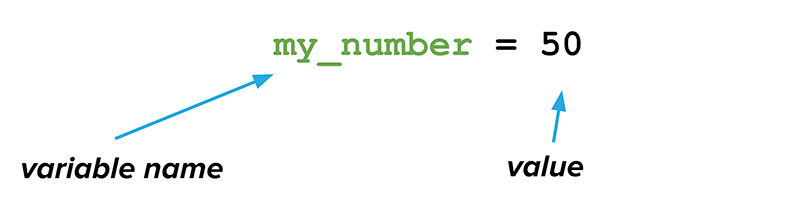
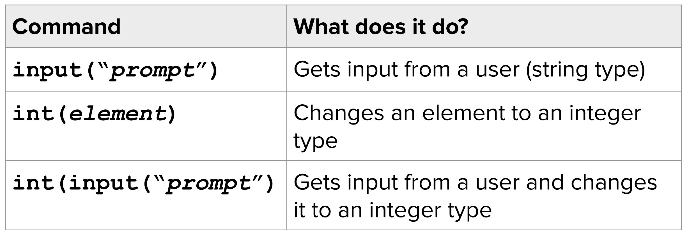
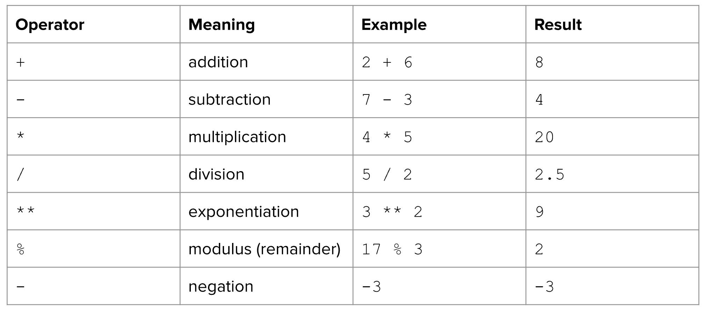
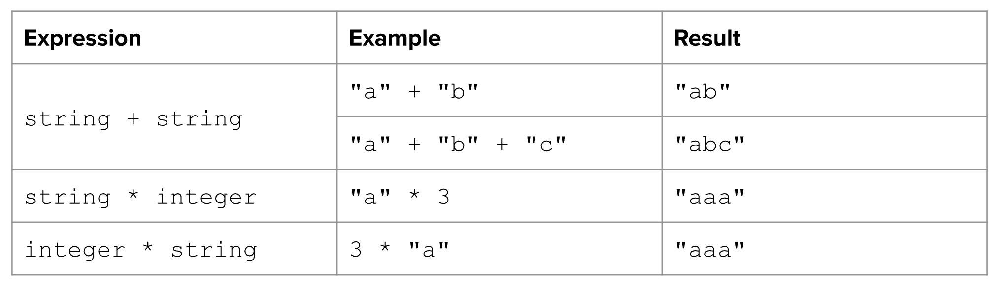

# Summary of Unit 1: Programming Basics
This is a summary of the topics covered in Unit 1: Programming Basics. 

When you have received the topics, try some of the challenges at the very bottom of this document.

## Printing
The `print()` statement is a function that outputs text to the screen. Some notes on its usage:

- String literals should be enclosed in quotes, e.g. `print("Hello, world!")`
- Variables can be output, without quotes, e.g. `print(user_name)`
- Strings can be **concatenated** or combined using a print statement. Both `+` and `,` can be used to concatenate strings, with slight differences:
    - **Plus** (`+`): The `+` operator only works with strings data types. If you are printing integers or floats using `+`, you must convert these to strings with a function like `str()`. For example:
        - `print("Hello, " + user_name + "!")`
        - `print("Total Price: $" + str(total_price))`
    - **Comma** (`,`): The `,` operator automatically converts non-string arguments to strings before printing, however, it *automatically adds a space* between the elements being printed. For example:
        - `print("Total Price:", total_price)`
        - `print("Name:", user_name, "Age:", num_user_age)`

## Variables
A variable is something that stores information in a program so that it can be used later.

### Variable Types
We've looked at several different types of variables in Python:

| Type      | Short Form | Definition                                             | Examples            |
|-----------|------------|--------------------------------------------------------|---------------------|
| String    | `str`        | A sequence of characters, enclosed within quotes       | `"hello"`, `'world'`    |
| Integer   | `int`        | A whole number without a decimal point                 | `5`, `100`, `-42`         |
| Float     | `float`      | A number with a decimal point                          | `3.14`, `-0.5`, `2.0`     |

### Variable Assignment Statement
A variable is created and updated using an **assignment statement**:



### Determining Type
You can use the `type` function in Python to determine a variable's type. For example:

#### Code
```python
greeting = "Hello, world!"
pritn(type(greeting))
```

#### Output
```
<class 'str'>
```

In addition, it is good programming practice to be strict about maintaing consistency with your variables and data types. Try to avoid using the same variable for strings and integers at different points in your program.

## Best Practices with Variable Naming
It's important to follow good variable naming conventions and style guidelines (outlined in a document called the [Python Enhancement Proposal 8](https://pep8.org/), or PEP8). This helps us write clean, readable, and maintainable code. 

Here are some good beginner variable rules based on PEP8:

### Use descriptive names
Choose variable names that are meaningful and describe their purpose or content. Avoid single-letter variable names except for loop indices or other very short-lived variables.

#### Good
```python
name = "John"
num_students = 10
```

#### Bad
```python
n = "John"
x = 10
```

### Use lowercase letters with underscores for multi-word names (i.e. snake_case)
Use underscores (_) to separate words in variable names for better readability.
#### Good
```python
max_speed = 100
user_name = "example"
```

#### Bad
```python
MaxSpeed = 100
userName = "example"
```

### Avoid using reserved words
Do not use special or reserved words as variable names.

#### Bad - 'class' is a reserved word
```python
class = "example"
```

### Be consistent
Maintain consistent naming conventions throughout your codebase.

#### Good
```python
max_speed = 100
min_speed = 50
```

#### Bad
```python
maxSpeed = 100
min_speed = 50
```

### Use meaningful prefixes for variable names in specific contexts
Use prefixes such as "is_" for Boolean variables, "num_" for counts or number variables, and "str_" for string variables.

#### Good
```python
is_valid = True
num_students = 10
str_name = "John"
```

#### Bad
```
valid = True
students = 10
name = "John"
```

### Avoid magic numbers
Assign numbers to variables with descriptive names instead of using them directly in your code.

#### Good
```python
max_speed = 100
acceleration = 9.8
```

#### Bad
```
distance = time * 9.8
```

## User Input
Use the `input()` function in Python to retrieve text from a user. Note that all input comes as the `string` data type. You can nuse **type conversion** to change a variable's type for further use.



## Mathematical Operators
These are a few of the most common mathetmatical operators seen in Python:



## String Operators
These are a few unique cases when using `+` and `*` operators on strings:



Adding two strings together is called **concatenation** and can only be done with strings. You can use type conversion (e.g. `str(3.14)`)to make sure that all elements are strings before concatenating.

## Comments
### Comment Types in Python

1. **Single-Line Comments**:
   - **Description**: Single-line comments are brief comments that span only one line. They are preceded by the `#` symbol.
   - **Usage**: Use single-line comments to provide short explanations, notes, or context for specific lines of code.
   - **Example**:

     ```python
     # This is a single-line comment
     x = 10  # This is another comment
     ```

   - **Good Practice**: 
     - Use single-line comments to clarify complex or non-obvious code.
     - Place comments *above* the line they describe for clarity.

   - **Try to Avoid**:
     - Avoid simply replicating code in comments, which can lead to redundancy and confusion:

       ```python
       num_a = 10  # num_a is 10
       num_b = 20  # num_b is 20
       
       # result is num_a + num_b
       result = num_a + num_b

       # print result
       print("Result:", result)
       ```

2. **Multi-Line Comments**:
   - **Description**: Multi-line comments, also known as docstrings, are used to document entire programs, functions, modules, or classes. They are enclosed within triple quotes (`'''` or `"""`).
   - **Usage**: Multi-line comments provide detailed documentation about purpose, usage, inputs, outputs, and behavior of entire programs, functions, modules, etc.
   - **Example**:

      ```python
      """
      File: celsius.py
      Author: Dave Cheng
      Date: 2024-02-21
      Description: Converts temperture from Celsius to Fahrenheit.
      """
      
      # Get Celsius temperature from user
      temp_celsius = float(input("Enter temperature in Celsius: "))

      # Convert Celsius to Fahrenheit
      temp_fahrenheit = (celsius * 9/5) + 32

      # Output result
      print("Temperature in Fahrenheit:", temp_fahrenheit)
      ```

   - **Good Practice**:
     - Use a multi-line comment as a program header to describe what a program does.
     - Use docstrings to document functions, methods, classes, and modules.
     - Follow a consistent docstring format to enhance readability and maintainability.

### Best Practices with Comments
- **Clarity Over Comments**: Strive to write clear and understandable code. Use comments only when necessary to explain complex logic or provide additional context.
- **Avoid Verbosity**: Ensure that you don't have *too many comments*. Code that is too verbose or wordy can take away from readability and clarity.
- **Consistency**: Follow consistent commenting conventions throughout your codebase to improve readability and maintainability.

<br><br>
# Practice Problems

## Problem 1
Create a program `collectdata.py` that asks for the following information and then outputs the information back to the console. Try to follow good variable naming practice from the notes above.

- name
- age
- current mark
- has been assigned a locker

#### Example Run 1
```
Enter your name: David
Enter your age: 16
Enter your current mark: 92.3
Have you been assigned a locker (True/False)? True

Name: David
Age: 16
Current Mark: 92.3
Locker Assigned: True
```

## Problem 2
Now, modify `collectdata.py` so that it prompts for a first name and last name, but outputs the data as one:

#### Example Run 2
```
Enter your first name: David
Enter your last name: Cheng
Enter your age: 16
Enter your current mark: 92.3
Have you been assigned a locker (True/False)? True

Name: David Cheng
Age: 16
Current Mark: 92.3
Locker Assigned: True
```

## Problem 3
Going to a restaurant in a large group can be a complicated experience, particularly when it comes to splitting the bill. 

Write a program `billsplitter.py` that calculates how much each person should pay based on a group meal's total bill after-tax. Ask the user for input (size of group, total bill, desired tip) and output the amount each person should pay.

1. Remember, the after-tax total includes the 13 percent HST. 
1. The calculated tip should not be based on the after-tax total, but rather, the pre-tax total. In other words, a 15% tip on a total bill of $113.00 should be $15 (15% of $100 pre-tax bill).
1. Dollar amounts are not integers (whole numbers) so you cannot use int(). They have decimal places. This data type is called a floating point number, or float(). You will need to convert the user's string input to floating point in order to be able to do decimal math with it.

#### Example Runtime
Here is a working example:
```
Restaurant Bill Splitter

How many people in your group? 5
What was the total bill after tax? 226
How much do you want to tip (standard is 15%)? 15

Each person should pay $51.20
```
Another example:
```
Restaurant Bill Splitter

How many people in your group? 3
What was the total bill after tax? 123.45
How much do you want to tip (standard is 15%)? 20

Each person should pay $48.43
```
One last set of numbers:
```
Restaurant Bill Splitter

How many people in your group? 8
What was the total bill after tax? 345.67
How much do you want to tip (standard is 15%)? 20

Each person should pay $50.86
```